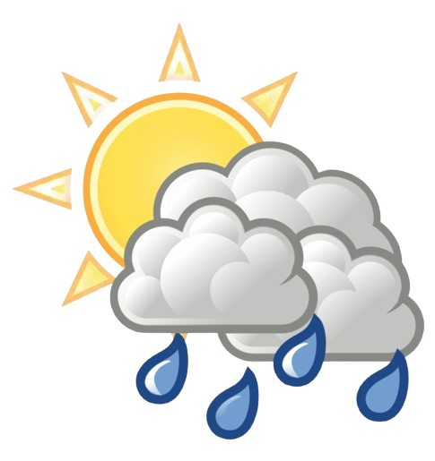

# Vishubh Weather Forecast

A modern weather forecast application built with ColdBox framework and BoxLang, providing 7-day weather forecasts for any city worldwide.



## Features

- 🌤️ **Real-time Weather Data**: Get current weather conditions for any city
- 📅 **7-Day Forecast**: View detailed weather predictions for the week ahead
- 🌓 **Dark/Light Mode**: Toggle between themes for comfortable viewing
- 📱 **Responsive Design**: Works seamlessly on desktop and mobile devices
- 🎨 **Modern UI**: Clean, card-based interface with Bootstrap 5
- 🔍 **City Search**: Easy-to-use search functionality
- 📍 **Geolocation Support**: Quick access to local weather (planned feature)

## Tech Stack

- **Backend**: ColdBox Framework with BoxLang
- **Frontend**: Bootstrap 5, jQuery
- **API**: Open-Meteo Weather API
- **Icons**: Bootstrap Icons

## Prerequisites

- BoxLang runtime
- CommandBox CLI
- Modern web browser

## Installation

1. Clone the repository:
```bash
git clone <repository-url>
cd "Vishubh Weather Forecast"
```

2. Start the server using CommandBox:
```bash
box server start
```

3. Open your browser and navigate to:
```
http://localhost:8080
```

## Usage

1. Enter a city name in the search box
2. Click "Search" or press Enter
3. View current weather conditions and 7-day forecast
4. Toggle between dark and light themes using the moon/sun icon

## Project Structure

```
Vishubh Weather Forecast/
├── coldbox/              # ColdBox framework files
├── config/               # Application configuration
│   └── Coldbox.cfc      # ColdBox settings
├── handlers/            # Event handlers
│   └── Main.cfc        # Main controller
├── layouts/             # Layout templates
│   └── Main.cfm        # Main layout
├── models/              # Business logic
│   └── WeatherService.cfc  # Weather API service
├── public/              # Public web root
│   ├── includes/       # CSS, JS, images
│   │   ├── css/
│   │   └── js/
│   ├── Application.bx  # Application configuration
│   └── index.cfm       # Entry point
├── views/               # View templates
│   └── main/
│       └── index.cfm   # Main view
├── box.json            # BoxLang dependencies
└── README.md           # This file
```

## API Integration

This application uses the [Open-Meteo API](https://open-meteo.com/) for weather data:
- Geocoding API for city coordinates
- Weather Forecast API for weather data
- No API key required
- Free for non-commercial use

## Configuration

### Framework Reinit
To reinitialize the ColdBox framework after configuration changes:
```
http://localhost:8080/?fwreinit=1
```

### Theme Customization
Edit `public/includes/css/style.css` to customize colors and styling.

## Development

### Adding New Features
1. Create handler methods in `handlers/Main.cfc`
2. Add corresponding views in `views/main/`
3. Update routes in `config/Coldbox.cfc` if needed

### Weather Icons
Weather condition icons are mapped in `views/main/index.cfm` using the `getWeatherIcon()` function.

## Troubleshooting

**Issue**: Double rendering of content
- **Solution**: Ensure `implicitViews: false` is set in `config/Coldbox.cfc`

**Issue**: Styles not loading
- **Solution**: Clear browser cache and reinit framework with `?fwreinit=1`

**Issue**: City not found
- **Solution**: Check spelling and try alternative city names

## Contributing

Contributions are welcome! Please feel free to submit a Pull Request.

## License

This project is open source and available under the MIT License.

## Credits

- Weather data provided by [Open-Meteo](https://open-meteo.com/)
- Built with [ColdBox Framework](https://www.coldbox.org/)
- UI components from [Bootstrap](https://getbootstrap.com/)

## Contact

For questions or support, please open an issue in the repository.

---

© 2025 Vishubh Weather Forecast
